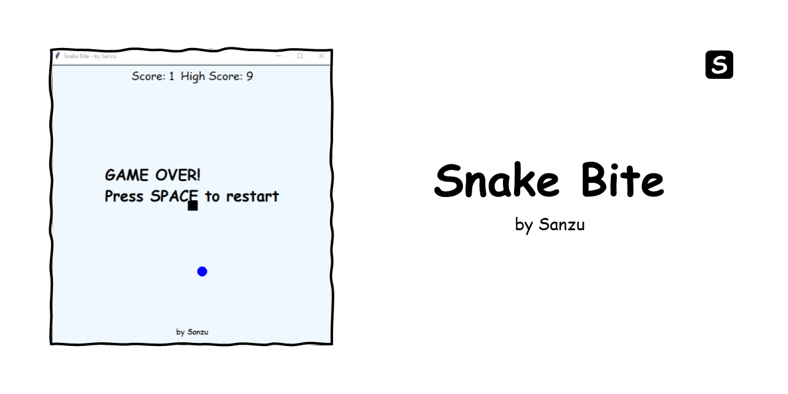

<p align="center">
  
</p>

## Snake Bite
A Snake Bite game built with Python and Turtle. Control a snake to eat food and grow longer while avoiding walls and own tail. The game features progressive difficulty with increasing speed as you score more points.

**Features:**
- Dual Control Schemes: Use either arrow keys or WASD keys
- Progressive Difficulty: Snake speeds up as you eat more food
- High Score Tracking: Keeps track of your best score during the session
- Game Over Screen: Clear indication when you lose with restart instructions
- Clean Design: Modern white background with sky blue accents

**Controls:**
- Arrow Keys or WASD: Move the snake (Up/W, Down/S, Left/A, Right/D)
- Spacebar: Restart the game after game over

**Rules:**
1. Guide the snake to eat the blue food
2. Each food eaten makes the snake grow longer and increases your score
3. Avoid hitting the walls
4. Avoid running into your own tail
5. The snake moves faster as your score increases

**Getting Started:**
- Python 3.x installed on your system
- Turtle graphics library (comes pre-installed with Python)
```bash
python snakeBite.py
```
**Contributing:**
Feel free to fork this project and add your own features! Some ideas.
- Add sound effects
- Implement different difficulty levels
- Add power-ups or obstacles
- Create different game modes
- Add a pause feature

---
Credits: `Sanzu`

For questions or suggestions, please open an issue on the repository.
Enjoy playing!
